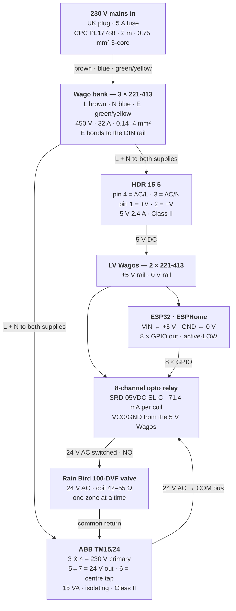

# Petrichor — Wiring & Cable Grades

Every conductor in the prototype, both ends, with the grade of cable each one must be.

`230 V · 5 A fuse as supplied` · `0.32 A total draw` · `7 Wagos` · rev **2026-07-30**

> **Provenance.** Figures below are taken from the datasheets in `../datasheets/`. Every
> load-bearing number was re-verified against those PDFs on 2026-07-30 — see
> [Verification log](#verification-log) at the foot for exactly what was checked and what
> changed. Anything not in that log is carried over unverified and marked ⚠.

---

## Regional assumptions

🌍 **Read this before adapting the mains side.**

**This whole document assumes a UK domestic supply.** Specifically: **230 V nominal
(+10 %/−6 %, so 216–253 V) at 50 Hz**, wired to **BS 7671** — the IET Wiring Regulations,
18th Edition, which is the UK implementation of the **IEC 60364 / CENELEC HD 60364** series.

The low-voltage side (5 V DC, 24 V AC SELV, the relay logic, the GPIO map) is universal. **The
230 V side is not**, and two of the assumptions below will actively mislead you if you're
elsewhere:

| Assumption | Where it breaks |
|---|---|
| ⚠️ **The plug contains a 5 A BS 1362 fuse** | Almost no other country fuses at the plug. The "22 AWG can't be protected by a 5 A fuse" argument depends on it. With only a 15–20 A branch breaker upstream (typical North American practice) there is **no** local overcurrent protection, so the wire-as-fuse-element failure mode gets **worse** — and 0.75 mm² stops being adequately protected either. Size your conductors to the *actual* upstream protective device. |
| ⚠️ **Brown = Line, Blue = Neutral, Green/Yellow = Earth** | IEC 60445 harmonised colours. North America uses black/white/green. Following the colour references here with non-harmonised cable will have you misidentify the line conductor. **Verify with a meter, never by colour** — the continuity test in [Before you touch the 230 V side](#before-you-touch-the-230-v-side) is the method, but its pin geometry is BS 1363-specific. |
| **RCD-protected socket** | UK/EU term. The North American equivalent is a **GFCI**; requirements and trip characteristics differ. |
| **SELV** (Safety Extra-Low Voltage) | An IEC/BS concept. The nearest US equivalent is an **NEC Class 2** circuit — similar intent, different rules. |
| **Cable standards `3183Y`, `H05VV-F`, `BS 6231` tri-rated** | BS/EN part numbers with no direct US equivalent. You'd be looking at SJT/SOOW for flex and THHN/MTW for singles, chosen against **NEC (NFPA 70)** ampacity tables, not the figures here. |
| **50 Hz** | The Rain Bird coil figures are quoted at 60 Hz in its datasheet and derived to 50 Hz in [section D](#getting-24-v-out-of-the-transformer). On a 60 Hz supply, use the datasheet values directly. |
| **UK plug pin geometry** | The lead-verification continuity test assumes a BS 1363 moulded plug. Meaningless on NEMA. |

Both DIN supplies (HDR-15-5, TM15/24) are **Class II**, which is a universal IEC concept — but
the HDR is universal-input (85–264 VAC) while the **ABB TM15/24 transformer is 230 V primary
only**. On a 120 V supply it would produce roughly half its rated secondary and the valves
would not pull in.

**None of this is a certified design in any jurisdiction.** It's a personal build log. If you
are adapting it, work to your own local wiring regulations and have a competent person check
the mains side.

---

## The one-glance answer

If you read nothing else on this page, read these five lines.

| | | |
|---|---|---|
| ✗ | **22 AWG never touches the mains side** | Not plug→Wago, not Wago→HDR, not Wago→transformer. It fits the Wago. That is the trap. |
| ✓ | **22 AWG is correct for everything else** | 5 V DC, 24 V AC and signals. That's what the kit was bought for. |
| ≡ | **Mains side is 0.75 mm², five wires to make** | Flex cores off the lead tail for the bench; tri-rated before the box goes outdoors. |
| E | **Earth terminates in its own Wago** | Both supplies are Class II — neither has an earth terminal. Never cut it off, never leave it floating. |
| ☂ | **The supplied lead is indoor flex** | H05VV-F is PVC-sheathed general-purpose cable. It is the one conductor that actually lives in the rain, and it is the least suited to it — see [The external lead](#the-external-lead--the-run-nobody-specified). |

---

## Cable grades

Cable is chosen by insulation rating and fault protection — **not** by whether it fits the terminal.

### 3183Y / H05VV-F flex — `MAINS OK · INDOORS`

3-core sheathed, stranded — the supplied lead.

| CSA | Volts | Temp | Amps |
|---|---|---|---|
| 0.75 mm² | 300/500 | 70 °C | 6 |

Cores usable as singles inside the box for the bench build. **18 AWG equivalent** — the
smallest size the HDR manual permits.

⚠️ **PVC insulation, PVC sheath, general-purpose — not an outdoor cable.** Fine as a source of
cores for internal wiring, and fine as a lead in the short term, but it is not the grade to leave
permanently in the weather. See [The external lead](#the-external-lead--the-run-nobody-specified).

### H07RN-F rubber flex — `OUTDOOR FLEX`

Rubber-insulated, rubber-sheathed, fine-stranded. The standard outdoor / site flex.

| CSA | Volts | Temp | Amps | Nominal OD |
|---|---|---|---|---|
| **1.0 mm²** (`3G1.0`) | 450/750 | 60 °C ⚠ | ⚠ not sourced | **8.3–10.7 mm** ✅ |

The correct replacement for the supplied lead once the box is a permanent outdoor fixture: the
rubber sheath resists **UV, oil and abrasion** where PVC chalks and cracks, and it stays flexible
in frost where PVC goes brittle. Higher voltage class than H05VV-F for the same CSA.

> ⛔ **Corrected 2026-09-06 — H07RN-F is not made in 3-core 0.75 mm².** Earlier revisions of this
> document (and of `specs/build-guide.md` 7A) specified *"H07RN-F 3-core 0.75 mm²"* as the
> like-for-like swap for the supplied lead. **That cable does not exist.** The **smallest 3-core
> H07RN-F made is 1.0 mm² (`3G1.0`)**. 0.75 mm² rubber flex is **H05RN-F** — 300/500 V, a different
> and lighter cable, one voltage class *down*, and therefore not the outdoor upgrade this section is
> arguing for. If the replacement is bought on CSA alone it will come back as the wrong cable.
> **Evidence class: manufacturer catalogue (Lapp), verified**, corroborated by Eland Cables and
> FS Cables. Not a seller listing.
>
> The current rating is left `⚠ not sourced` rather than carried over: the old `~7 A` figure was
> attached to a CSA that isn't produced. It is in any case not the binding number here — **the 5 A
> BS 1362 plug fuse is the governing protection**, and 1.0 mm² is a step *up* from the 0.75 mm²
> it replaces, so the fuse-versus-conductor argument only gets safer.

> ⚠️ **The gland already owned will not take it.** Lapp gives `3G1.0` a nominal OD of
> **8.3–10.7 mm** (manufacturer catalogue, verified). The **WEMNO M16** glands in hand are rated
> **3–8 mm** — so an H07RN-F lead needs an **M20 gland**, not the M16. This is not a
> measure-it-on-the-day question; the smallest OD in the range is already outside the M16's
> largest. Buy the M20 **with** the cable or the lead cannot be terminated. Cross-referenced at
> `build-work-plan.md` Phase A (*"M20 gland if needed"* — it is now *needed*, conditional on the
> lead swap) and `specs/build-guide.md` Stage 6 step 2 / 7A step 3.

### Tri-rated BS6231 — `PREFERRED`

Single core, stranded Class 5 — also UL1015 / CSA.

| CSA | Volts | Temp | Amps |
|---|---|---|---|
| 0.75 mm² | 600/1000 | 105 °C | ~14 |

The right answer for the permanent outdoor build — a sealed box in summer sun eats the
margin on 70 °C insulation.

### UL1007 hook-up — `MINIMUM`

Mean Well's own named example. 300 V, 80 °C. The floor the manual asks for: *"wires that can
withstand temperatures of at least 80 °C, such as UL1007."* Listed for reference only.

### 22 AWG hook-up kit — `NEVER ON MAINS`

HuLuWa 6-colour.

| CSA | Volts | Temp | Amps |
|---|---|---|---|
| 0.33 mm² | ~300 | 80 °C | ~3 |

SELV only. Below the manual's minimum size, and a 5 A fuse cannot protect a 3 A wire.

### Dupont jumper — `SIGNAL ONLY`

EDGELEC kit, 24–26 AWG, <1 A. GPIO to relay inputs. Nothing else.

---

### ⚠ Why 22 AWG fails on the mains side

The plug fuse is **5 A**, and that fuse protects everything downstream of it. 22 AWG carries
about **3 A** — so under a fault the **wire becomes the fuse element**, melting its insulation
and igniting before a 5 A fuse reacts.

An RCD will not catch it. It isn't an earth fault; it's a wire cooking in a sealed plastic box.

### The 70 °C question — bench versus garden

3183Y flex cores are 70 °C against the manual's 80 °C ask. At 0.25 A through 0.75 mm² the
self-heating is negligible, so it's a non-issue **on the bench**.

It matters **outdoors**: a sealed IP65 box in sun reaches 50–60 °C internally plus the PSU's
own 3 W. Re-wire in tri-rated before it goes outside.

### The external lead — the run nobody specified

Everything above is about conductors **inside** the box. The one cable that actually lives in the
weather is the supplied lead itself, and until now this document never examined it.

**What it is:** `CPC PL17788` = **Pro Elec PELB2340** — *"UK Mains Plug with 5A Fuse to Bare Ends
Mains Lead, 0.75 mm, 2 m, Black"*, £2.65 on CPC order 20171387 (2026-07-19). Identified here as
3183Y / H05VV-F ⚠ — CPC's listing states only the CSA, length and colour, so the grade is inferred
from the form factor, not from a datasheet.

**Where it sits.** Two enclosures, neither of them IP66:

| Enclosure | Rating | Contains |
|---|---|---|
| RESTMO weatherproof box | **IP54** ⚠ — splashing water only | the plug and its socket |
| CE-TEK GR17016 | **IP65** | ESP32, relay, HDR-15-5, TM15/24 |

Between them: **~2 m of PVC-sheathed indoor flex, fully exposed.**

**The risk is degradation, not shock.** The sheath is intact, PVC is waterproof, each core is
separately insulated inside it, and the socket is RCD-protected — rain landing on a sheathed
3-core flex does nothing. What rain and sun do over *seasons* is chalk and harden the PVC until
the sheath cracks, and a cracked sheath is what finally lets water at the cores. PVC also stiffens
below roughly −5 °C, so **don't flex or reroute the lead in a hard frost.**

⚠️ **The failure mode to design against is water tracking *along* the sheath**, not water landing
on it. Three free mitigations, all of which the guide already applies elsewhere:

| | Do this | Already specified at |
|---|---|---|
| 1 | **Drip loop at both ends** — a U hanging below each entry so water runs to the bottom and drips off instead of following the sheath in | 7B, for the field cable |
| 2 | **Enter through a bottom or lower-side face**, never the top | Stage 6, step 2 |
| 3 | **Keep the run off the ground** — not lying where it can sit in standing water or meet a strimmer | — |

**The fix, when it stops being a prototype:** replace the lead with **H07RN-F `3G1.0`**, or sleeve
the exposed section in conduit. The same reasoning this document already applies to the internal
wiring — *"re-wire in tri-rated before it goes outside"* — applies to the lead. It simply was
never followed through to the one conductor that is genuinely outdoors.

⛔ **Two things to get right when buying it — added 2026-09-06:**

| | |
|---|---|
| **Not 0.75 mm²** | H07RN-F is not made in 3-core 0.75 mm². Smallest 3-core is **1.0 mm² (`3G1.0`)**; 0.75 mm² rubber flex is **H05RN-F**, 300/500 V — a lighter cable and a voltage class down. Ask for `3G1.0`, not "the same as what's on there". |
| **M20 gland, not the owned M16** | `3G1.0` is **8.3–10.7 mm** OD; the WEMNO M16 in hand seals **3–8 mm**. The whole OD range is outside it. **The gland is part of the lead swap, not a separate maybe.** |

*Evidence class: **manufacturer catalogue (Lapp), verified*** — CSA availability and the OD range
both come from Lapp's own catalogue, corroborated by Eland Cables and FS Cables. Not a seller
listing, not a marketplace title.

---

## Topology

One feed in, split at the Wago bank, two rails out.

Note the last edge: the valve returns to the **transformer**, not to earth. The 24 V secondary
is a closed, floating SELV loop — see [Non-negotiables](#non-negotiables).

---

## A · 230 V mains

`0.75 mm²` · 8 conductors · **plug OUT of the wall**

| Ref | From | To | Colour | Notes |
|---|---|---|---|---|
| **A1** | Plug L *(via 5 A fuse)* | Wago-L port 1 | brown · supplied | Part of the lead · strip 11 mm · bare into the lever |
| **A2** | Plug N | Wago-N port 1 | blue · supplied | Part of the lead · strip 11 mm |
| **A3** | Plug E | Wago-E port 1 | green/yellow · supplied | Part of the lead · strip 11 mm · **never cut off** |
| **A4** | Wago-L port 2 | HDR pin 4 `AC/L` | brown · to make | Wago bare 11 mm · HDR **ferrule** 6 mm · 4.4 lb-in |
| **A5** | Wago-N port 2 | HDR pin 3 `AC/N` | blue · to make | Wago bare 11 mm · HDR **ferrule** 6 mm · 4.4 lb-in |
| **A6** | Wago-L port 3 | TM15/24 terminal 3 | brown · to make | Transformer 230 V primary · ferrule |
| **A7** | Wago-N port 3 | TM15/24 terminal 4 | blue · to make | Transformer 230 V primary · ferrule |
| **A8** | Wago-E port 2 | DIN rail earth bond | green/yellow · to make | Ring crimp under M4 + star washer, or a DIN earth block. Deburr the cut rail first. |

**Mains group totals:** 5 conductors to make · 10 ends · 4 ferrules · 1 ring crimp.
HDR terminals are 3 mm slotted, strip 6 mm, torque 5 kgf-cm (4.4 lb-in).
Wago 221-413 is rated 450 V, 32 A, 0.14–4 mm². ⚠

---

## B · 5 V DC logic

`22 AWG kit` · 6 conductors · SELV

| Ref | From | To | Colour | Notes |
|---|---|---|---|---|
| **B1** | HDR pin 1 `+V` | Wago-+5V | red | Ferrule at the HDR end |
| **B2** | HDR pin 2 `−V` | Wago-0V | black | Ferrule at the HDR end |
| **B3** | Wago-+5V | ESP32 `VIN` | red | **Not** the 3V3 pin — that bypasses the regulator and kills the chip |
| **B4** | Wago-0V | ESP32 `GND` | black | Shared reference |
| **B5** | Wago-+5V | Relay `VCC` | red | Coil current bypasses the ESP32's traces |
| **B6** | Wago-0V | Relay `GND` | black | Common ground — miss this and nothing works |

**Why two extra Wagos rather than doubling up.** The HDR has **one** `+V` and **one** `−V`.
The manual warns against *"too much current stress on a single contact"* — so one clean wire
per terminal, split at the Wago.

Budget: ESP32 ~250 mA plus one relay coil at 71.4 mA ⚠ (the interlock means only one is ever
energised) against the HDR's **2.4 A**. Nowhere near stressed.

> **There is deliberately no GND wire between the ESP32 and the relay board.** Both take 0 V
> from the same Wago — that *is* the shared reference. A second link would only be a parallel
> path to the same net, and worse: if the relay's Wago leg worked loose, coil return current
> would sneak back through the ESP32's GND pin and traces.

---

## C · Signal

Dupont F-F · 8 jumpers · 3.3 V logic

| Ref | GPIO | → | Relay input |
|---|---|---|---|
| **C1–C8** | 13 · 16 · 17 · 18 · 19 · 21 · 22 · 23 | → | IN1 · IN2 · IN3 · IN4 · IN5 · IN6 · IN7 · IN8 |

In order — GPIO13→IN1 through GPIO23→IN8.

> **Pin choice is deliberate.** Avoided: GPIO 0/2/5/12/15 (strapping pins — these cause relay
> chatter at boot), 6–11 (flash), 34–39 (input-only). Firmware needs `inverted: true` and
> `restore_mode: ALWAYS_OFF`.

> ⚠ **Silkscreen trap.** On this 30-pin DevKit **GPIO16 = `RX2`** and **GPIO17 = `TX2`** —
> there are no pins marked `D16`/`D17`. `TX0`/`RX0` sit right beside them and must be avoided.

---

## D · 24 V AC load side

`22 AWG kit` · SELV, safe to handle

### The mental model

Each relay channel is a **single-pole double-throw switch**. `COM` is the pole — the *only*
entry. It rests on `NC` and swings to `NO` when energised. `NC` and `NO` are two alternative
destinations for the same current, **not** stages in a chain. There is no electrical path
between channels inside the board: a terminal block is plastic, not a circuit, so `COM1` and
`COM2` share a housing but are **not** connected.

### Finding the screws

The terminal blocks carry **no markings at all** — 24 identical screws in four blocks of six.
Orient the board with terminals along the top edge and the `IN1` end of the signal header on
your left, then count 1→24 left to right. Each relay cube has three screws above it, ordered
`NC · COM · NO`:

| Screw | 1 | **2** | *3* | 4 | **5** | *6* | 7 | **8** | *9* | 10 | **11** | *12* |
|---|---|---|---|---|---|---|---|---|---|---|---|---|
| | NC1 | **COM1** | *NO1* | NC2 | **COM2** | *NO2* | NC3 | **COM3** | *NO3* | NC4 | **COM4** | *NO4* |

| Screw | 13 | **14** | *15* | 16 | **17** | *18* | 19 | **20** | *21* | 22 | **23** | *24* |
|---|---|---|---|---|---|---|---|---|---|---|---|---|
| | NC5 | **COM5** | *NO5* | NC6 | **COM6** | *NO6* | NC7 | **COM7** | *NO7* | NC8 | **COM8** | *NO8* |

- **COM** = screws 2, 5, 8, 11, 14, 17, 20, 23 — the 24 V feed bus
- **NO** = screws 3, 6, 9, 12, 15, 18, 21, 24 — one valve each
- **NC** = screws 1, 4, 7, 10, 13, 16, 19, 22 — **all permanently empty**

Block housings read `J3 · J5 · J4 · J6` left to right (out of order — ignore the designators).
Channels run 1→8 in sequence; trios never straddle a gap.

### D-POC — one valve, 3 conductors

| Ref | From | To | Notes |
|---|---|---|---|
| **D1** | TM15/24 terminal 5 | Relay `COM1` *(screw 2)* | 24 V hot. POC uses COM1 only — do **not** bus all eight yet |
| **D2** | Relay `NO1` *(screw 3)* | Valve coil lead A | 24 V switched. Join to the valve tail with a Wago |
| **D3** | Valve coil lead B | TM15/24 terminal 7 | 24 V return. Join to the valve tail with a Wago |

### D-FULL — eight zones

The four blocks are electrically independent; **you build the bus.**

| Ref | From | To | Screw → screw |
|---|---|---|---|
| **DF1** | TM15/24 terminal 5 | COM1 | → **2** |
| **DF2** | COM1 | COM2 | **2** → **5** |
| **DF3** | COM2 | COM3 | **5** → **8** *(crosses block gap)* |
| **DF4** | COM3 | COM4 | **8** → **11** |
| **DF5** | COM4 | COM5 | **11** → **14** *(crosses block gap)* |
| **DF6** | COM5 | COM6 | **14** → **17** |
| **DF7** | COM6 | COM7 | **17** → **20** *(crosses block gap)* |
| **DF8** | COM7 | COM8 | **20** → **23** |

**Every jumper skips exactly two screws.** Then one tail per zone: `NOn` → that valve's coil,
and every coil's other lead onto a **single shared common** running back to terminal 7.

> **Double-landed screws.** `COM1`–`COM7` each carry two wires (one arriving, one leaving);
> only `COM8` has one. Fine at this current, but it fails *quietly* — the clamp seats on
> whichever conductor sits proud and the other looks fitted but isn't, killing every zone
> downstream. Twist the pair before inserting (or use twin-entry ferrules), then tug-test each
> tail individually. `COM1`↔`COM8` should beep when the bus is complete.

### Field wiring

**The common lives at the manifold, not in the box.** One multi-core cable runs out; at the
valves a single common conductor daisy-chains across every solenoid, with one individual
conductor per valve back to its `NO`. So the box side is **one wire from terminal 7**
regardless of zone count.

That sets the field cable core count: **zones + 1**, not zones × 2.

⚠ **22 AWG is bench only.** The field run needs **outdoor/UV-rated multicore**, zones + 1 cores.
At the actual geometry — **<10 m box→manifold**, ~0.3 A per valve — **0.5–0.75 mm² is ample**;
volt-drop is negligible, and more so at the ~29 V the secondary actually sits at. Buried runs want
**direct-burial-rated cable or a duct**, with a drip loop at each end. It's SELV, so the rating is
about **water, UV and abrasion, not shock**.

⚠ **The connections in the valve box are the weak point, not the cable.** An in-ground valve box
floods; the solenoid coils tolerate it, bare joints don't. Every solenoid joint must be a
**gel-filled / IP68 connector** (gel Scotchlok, resin, or waterproof crimp + adhesive heatshrink) —
**never a dry Wago in the ground.** Wagos are a *dry-box* connector; they belong in the enclosure,
not the earth.

### Getting 24 V out of the transformer

Take **5 ↔ 7**. Terminal **6** is a **centre tap** — measure 5–6 or 6–7 and you'll read 12 V
and think it's broken. There is nothing to join in series. No polarity on an AC secondary.

⚠ **Expect ~29 V, not 24 V.** The TM15/24 is a **bell transformer** — ABB's datasheet describes it
as a *"fail safe bell transformer"* suitable for *"loads that call for a discontinuous supply"*.
That class is deliberately wound with high leakage inductance and poor regulation, which is what
makes it inherently short-circuit-safe; the **24 V nameplate is the full-load figure**. Measured
**29.4 V off-load / 29.2 V at the coil** on 2026-08-09. The datasheet quotes no regulation figure
or off-load voltage, so there is nothing to check this against — it is simply how the part behaves.

Because the interlock only ever allows **one** valve, the load never rises above ~43 % of 15 VA, so
the secondary sits at ~29 V **permanently** — it does not settle toward 24 V in normal operation.
That is ~22 % above the valve's nominal 24 V and outside Rain Bird's ±10 % window. Accepted for
this build: irrigation duty is short bursts, and the alternatives are all poor value (the 12 V tap
won't pull the valve in, a dropper resistor just moves the heat, and a better-regulated transformer
is real money against a failure that hasn't happened). Recorded so an early coil failure isn't a
mystery.

**Valve load (Rain Bird 100-DVF):** datasheet gives **0.30 A inrush (7.2 VA)** and
**0.19 A holding (4.6 VA)** — but those are the **60 Hz** figures. On UK **50 Hz** the coil's
reactance is lower and current runs roughly **0.34 A inrush / 0.22 A holding** (~8 VA / ~5 VA).
Coil resistance 42–55 Ω. Against the transformer's 15 VA that is comfortable for **one zone at
a time**, which the firmware interlock enforces. Don't gang zones.

---

## Tally

What's in hand and what still needs sourcing.

| Group | Cable | Count | Status |
|---|---|---|---|
| 230 V mains | 0.75 mm² flex cores → tri-rated outdoors | 5 | `SOURCE` |
| 5 V DC | 22 AWG hook-up | 6 | `IN HAND` |
| Signal | Dupont F-F | 8 | `IN HAND` |
| 24 V AC *(POC)* | 22 AWG hook-up | 3 | `IN HAND` |
| 24 V AC *(full 8-zone bus)* | 22 AWG hook-up | 8 | `IN HAND` |
| Wago 221-413 | 450 V · 32 A | 7 | `50-PACK` |
| Ferrules | 0.75 mm² · 6 mm bootlace | 6 | `SOURCE` |
| Earth bond | DIN earth block, or M4 + ring crimp | 1 | `SOURCE` |
| Field cable to manifold | ✅ **Rain Bird `RB/IRRICAB5-15M` — 5-core, 15 m** (EGI144337, delivered 2026-08-27). Spec was "zones + 1 cores, <10 m"; **5 cores = 4 zones + common**, matching the 4-way manifold of decision #19, and 15 m gives headroom over the <10 m estimate. | 1 × 15 m | `IN HAND` |
| External mains lead *(socket → box)* | supplied **H05VV-F** ⚠ is indoor grade — replace with **H07RN-F `3G1.0`** (⛔ **not** 0.75 mm²; that size only exists as **H05RN-F**), or sleeve in conduit, once permanent | 1 | `IN HAND` *(interim)* |
| Mains cable gland — **as built** | WEMNO **M16** nylon IP68, **3–8 mm** range. Fits the *supplied* H05VV-F lead. | 1 | `IN HAND` *(pack of 10)* |
| Mains cable gland — **for the H07RN-F swap** | **M20.** `3G1.0` is **8.3–10.7 mm** OD (Lapp catalogue, verified) — the entire range is above the M16's 8 mm ceiling, so this is **not** a "step up if it measures over 8 mm" judgement call. Buy it **with** the cable. | 1 | `SOURCE` *(only when the lead is replaced — see Phase E)* |
| Vented drain / breather | IP-rated M12–M16 breather plug | 1 | `SOURCE` |
| Valve-box connectors | ✅ **Rain Bird `RB/DBRY.P2` ×2 = 4 DBR/Y gel-filled direct-burial splices** (EGI144337, delivered 2026-08-27). 2 zones + common = 3 joints needed, 4 owned. | 4 | `IN HAND` |

> **Cheapest route to the five mains wires.** Cut **400 mm off the lead's bare-end tail** and
> split the sheath — that's 0.75 mm² flex in exactly the three colours you need, free, tonight.
> Leaves 1.6 m of lead, plenty for a bench test.
> Buying instead: SHPELEC 3183Y 0.75 mm 3-core, ~£14 — but check stock, the 10 m variant was
> reading unavailable.

---

## Before you touch the 230 V side

**Verify the lead cores — don't trust colour.** It's a moulded plug, so you can't see inside.
**Pull the fuse out.** Blue should beep to the left-hand pin, green/yellow to the long top pin,
and **brown should beep to nothing** — the fuse sits in the Live path. Refit it and brown beeps
to the right-hand pin. That's proof, not assumption.

**If you split a sheathed flex for its cores.** Electrically fine — the cores are 300/500 V
insulated. Two rules: **the sheath must pass through the gland** and stop just inside the box,
because the sheath is the mechanical protection at the entry point; and **score it lengthways**
to open it, never ring-cut and drag, or you'll nick a core.

---

## Non-negotiables

- **Plug out of the wall** for all of it. RCD-protected socket for first power-up.
- **5 A fuse as supplied** is correct for 0.75 mm² (6 A rated). Leave it.
- **Neither supply has an earth terminal** — both Class II. Earth goes to its own Wago and
  bonds to the rail.
- **Don't wire the HDR's centre front screw** — that's the `Vo ADJ` trimmer, turn-only. Set it
  to 5.00 V once live.
- **Don't bridge primary and secondary.** Manual warning 2: *"Connecting both the primary and
  the secondary sides together is not allowed."*
- **The 24 V secondary stays floating.** It is not earthed and must not be bonded. That is what
  makes it safe to handle — there is no return path through you. Measure it against terminal 7,
  **never against earth**, or you'll read meaningless capacitive drift.
- **All eight `NC` screws stay empty.** A valve on `NC` waters the garden whenever the
  controller is off or crashed.
- **Measure before trusting:** L–N open-circuit before power-up (a short means stop), then
  ~5 V DC and **~29 V AC off-load** (not 24 — see [Getting 24 V out of the transformer](#getting-24-v-out-of-the-transformer))
  before anything downstream is connected.
- **Off-load readings on the 24 V side are not measurements.** An unloaded floating SELV winding
  seen through a 10 MΩ meter input reads capacitive coupling, not voltage — it will drift and
  respond to your hand. Both probes stay on the same low-voltage loop, and judge only readings
  taken with a real load in circuit. This project has been caught by it twice: a 33 V phantom on
  an open `NO` contact and a spurious 22 V on an unloaded one.
- If you're not confident on the mains side, have a competent person check it. This is a build
  guide, not a certified electrical drawing.

---

## Verification log

Checked on **2026-07-30** against the PDFs in `../datasheets/`. The original of this document
was written away from the source files; these are the numbers that were re-confirmed.

| Claim | Source | Result |
|---|---|---|
| HDR pins 1=+V, 2=−V, 3=AC/N, 4=AC/L | `HDR-15-5_MeanWell_5V-PSU.pdf` p.4 terminal table | ✅ exact |
| HDR 5 V / 2.4 A, Isolation class Ⅱ, four pins only | same, p.2 spec table | ✅ exact |
| HDR `Vo ADJ` range 4.5–5.5 V | same, p.2 | ✅ exact |
| Valve 24 VAC, inrush 0.30 A (7.2 VA), hold 0.19 A (4.6 VA), coil 42–55 Ω | `100-DVF_RainBird_solenoid-valve.pdf` p.1 | ✅ exact — **but stated at 60 Hz**; 50 Hz figures derived above |
| TM15/24 secondary 12–24 V AC, 15 VA, terminal 6 = centre tap | `TM15-24_ABB_transformer.pdf` p.3–4 + product label | ✅ confirmed |
| TM15/24 is a *"fail safe bell transformer"* for *"loads that call for a discontinuous supply"*; 230 V primary, max power loss 4 W, ta 40 °C class B, Iout max 1.25 A (the 12 V figure — 15 VA ÷ 12 V) | `TM15-24_ABB_transformer.pdf` p.3–4 | ✅ exact |
| TM15/24 **regulation / off-load secondary voltage** | — | ❌ **not specified anywhere in the datasheet.** Measured 29.4 V off-load, 29.2 V at the coil (2026-08-09). Treated as characteristic of the bell-transformer class, not a fault |
| Relay contacts 10 A 250 VAC / 10 A 30 VDC | Songle relay body marking, ELEGOO datasheet p.1 | ✅ confirmed |
| Relay screw order `NC · COM · NO`, channels 1→8 in sequence | ELEGOO schematic (`J3` = pins 1–6) + module dimension drawing | ✅ confirmed |
| Wago 221-413 rated 450 V / 32 A / 0.14–4 mm² | — | ⚠ not re-checked |
| Songle coil 71.4 mA | — | ⚠ not re-checked |
| Lead spec CPC PL17788 / order 20171387 | CPC order confirmation, 2026-07-19 | ✅ **Pro Elec PELB2340**, *"UK Mains Plug with 5A Fuse to Bare Ends Mains Lead, 0.75 mm, 2 m, Black"*, £2.65. Confirms CSA, length, 5 A fuse and moulded plug |
| Lead **cable grade** (3183Y / H05VV-F) | — | ⚠ **inferred, not stated.** CPC's listing gives only CSA, length and colour. The H05VV-F identification is from form factor. Material matters — see [The external lead](#the-external-lead--the-run-nobody-specified) |
| Plug **IP rating** | CPC listing + price | ✅ **none.** A standard moulded BS 1363 plug carries no IP rating and none was intended — weather protection comes from the enclosure it sits in, not the plug |
| RESTMO plug enclosure **IP54** | Amazon order 206-6337738-2459509, 2026-09-06 | ⚠ vendor title only. **IP54 = splashing water**, below the **IP66** assumed in build guide 7A. Acceptable wall-mounted with entries down; not acceptable ground-sited |
| **H07RN-F smallest 3-core CSA** | **Lapp manufacturer catalogue**, corroborated by Eland Cables and FS Cables (2026-09-06) | ⛔ **Correction. 3-core 0.75 mm² H07RN-F does not exist** — the smallest 3-core made is **1.0 mm² (`3G1.0`)**. 0.75 mm² rubber flex is **H05RN-F**, 300/500 V. Every *"H07RN-F 3-core 0.75 mm²"* in this repo was wrong. **Evidence class: manufacturer catalogue, verified** — not a seller listing |
| **H07RN-F `3G1.0` nominal OD** | **Lapp manufacturer catalogue** (2026-09-06) | ✅ **8.3–10.7 mm.** The owned **WEMNO M16** gland seals **3–8 mm**, so the H07RN-F lead needs an **M20** gland. The *whole* OD range sits above the M16 ceiling — this is settled by the catalogue, not by measuring on the day. **Evidence class: manufacturer catalogue, verified** |

---

*Petrichor irrigation controller · wiring rev 2026-07-30 · mirrors `docs/wiring-diagram.html`
in the source repo. Supersedes `wiring-and-cable-grades.pdf` (removed 2026-07-30).*
